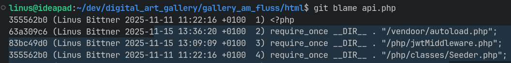

## git blame

**Description:**

`git blame` shows which commit and author last modified each line of a file. It helps to understand the history of specific lines of code.

**Goal / Purpose:**

- Trace the origin of a particular line of code.
- Investigate when and by whom a line was last changed.
- Understand historical context or reasoning for changes.

**Syntax:**

```bash
git blame <file>

```

**Example:**

```bash
git blame main.py

```

Output example:

```
a1b2c3d4 (Alice 2024-05-12  12) def calculate_total(price, tax):

```

This shows that line 12 of `main.py` was last modified by Alice in commit `a1b2c3d4` on May 12, 2024.

**Typical Use Case:**

When debugging or reviewing unclear code, use `git blame` to identify who made a change and when, so you can review the related commit or ask for context.

**User story 1:**

